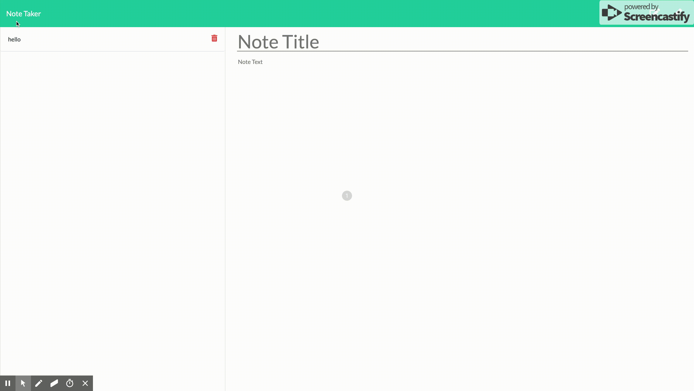

# Note-Taker

## Description

Different people has various way to take note according to their preference. There is no absolute the best way for specific people to take note. Whatever method they get most usded to is the best for themselves. In this project, I am creating an application that can be used to write, save, edit and delete notes. This application will use an express backend and save and retrieve note data from a JSON file.

Here is how the application made of:
* Landing Page with start button
* Note Page with two main columns:
    * The left column is the list of saved note with edit and delete functions
    * The right column is the note taking area with view and edit functions
* API JSON data page to store all the saved data in JSON format

### Demo

In the process of building application, I have learned:
* Utilize Github repository, familiarize git commands to save all my works onto github

* Familiarize the basic html commands to build the full contents of the site

* Familiarize utilizing <b>node.js</b>, especially:
    * researching various npm
    * util npm -- generate new promise
    * fs npm -- read/write file

* Familizrize manipulating Express.js, especially:
    * Utilizing post and delete command
    * Convert back and forward JSON and String format

* First time to use app.delete api feature to enable delete note function

* First time to use app.post api feature to enable edit and update note function

## Credits 

I am here to acknowlage to the Coding Bootcamp of University of Washington along with below falcuties:
* Jason Rosen (Instructor)
* Daniel Mont-Eton (TA)
* Kris Shore (TA)

## License
MIT License

Copyright (c) [2019] [Norman Lei]

Permission is hereby granted, free of charge, to any person obtaining a copy
of this software and associated documentation files (the "Software"), to deal
in the Software without restriction, including without limitation the rights
to use, copy, modify, merge, publish, distribute, sublicense, and/or sell
copies of the Software, and to permit persons to whom the Software is
furnished to do so, subject to the following conditions:

The above copyright notice and this permission notice shall be included in all
copies or substantial portions of the Software.

THE SOFTWARE IS PROVIDED "AS IS", WITHOUT WARRANTY OF ANY KIND, EXPRESS OR
IMPLIED, INCLUDING BUT NOT LIMITED TO THE WARRANTIES OF MERCHANTABILITY,
FITNESS FOR A PARTICULAR PURPOSE AND NONINFRINGEMENT. IN NO EVENT SHALL THE
AUTHORS OR COPYRIGHT HOLDERS BE LIABLE FOR ANY CLAIM, DAMAGES OR OTHER
LIABILITY, WHETHER IN AN ACTION OF CONTRACT, TORT OR OTHERWISE, ARISING FROM,
OUT OF OR IN CONNECTION WITH THE SOFTWARE OR THE USE OR OTHER DEALINGS IN THE
SOFTWARE.

Ajax Autocomplete for jQuery is freely distributable under the terms of an MIT-style license.
Copyright notice and permission notice shall be included in all copies or substantial portions of the Software.

